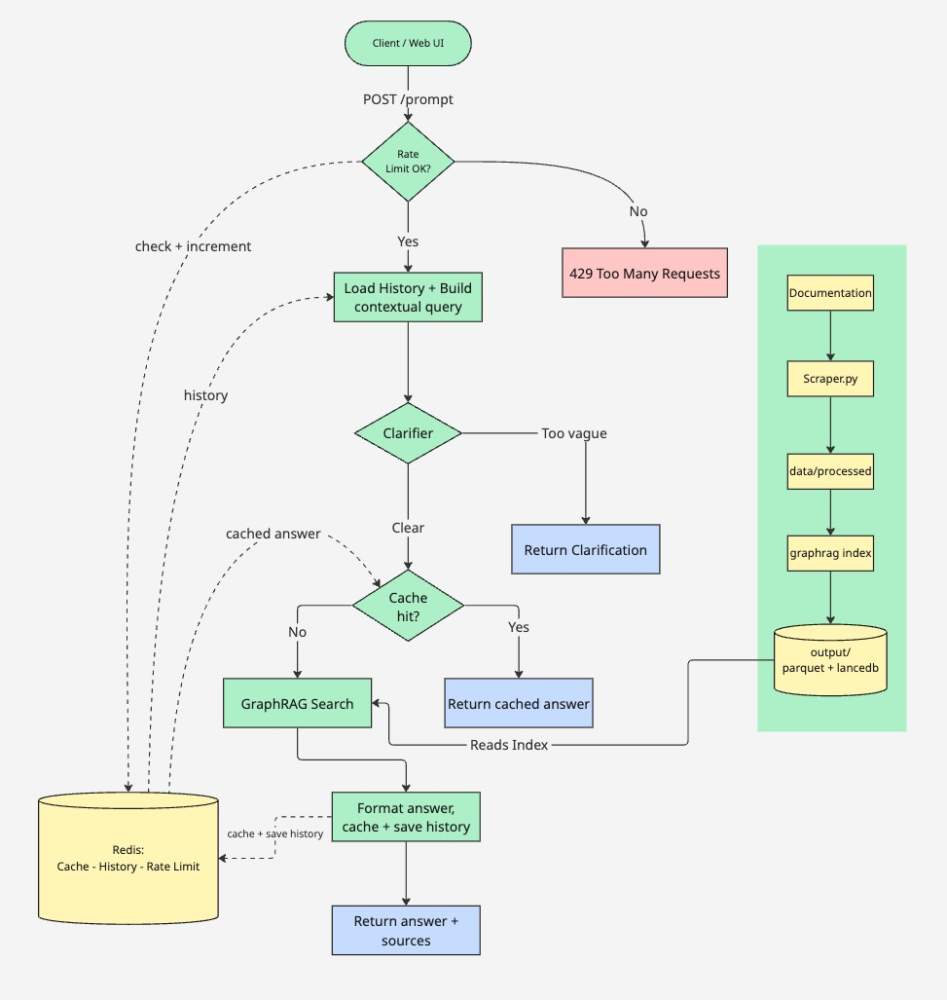

# GraphRAG Documentation Chatbot


A GraphRAG-based documentation chatbot built on [Microsoft's open-source GraphRAG](https://github.com/microsoft/graphrag). Developed as a bachelor's thesis project at the University of Gothenburg / Chalmers University of Technology, the core research focused on applying and evaluating a structured non-functional requirements (NFR) management framework during the development of an ML-based system. The chatbot itself was built as an MVP artifact of that research process. Upon completion, the MVP was handed over to the industrial partner for further development and is being integrated into their software as an in-product assistant for their existing user base.

The chatbot was originally built for an industrial partner (kept anonymous) and has been adapted here to use [Kubernetes concepts documentation](https://kubernetes.io/docs/concepts/) as a freely available, publicly scrapeable documentation source that demonstrates the same architecture working on real technical content.

## Bachelor's thesis

**Title:** _Applying and Evaluating a Non-Functional Requirements Management Framework for a GraphRAG-Based Documentation Chatbot: An Industrial Case Study_

**Authors:** Emma Olmås · Erik Lidbom · Fredrik Nilsson

**Institution:** University of Gothenburg / Chalmers University of Technology — Bachelor of Science in Software Engineering and Management, 2026

**Supervisor:** Antonia Welzel · **Examiner:** Gregory Gay

The primary contribution of this thesis is the research, not the implementation. The thesis applies and evaluates a five-step NFR management framework (Habibullah et al.) during the development of a GraphRAG chatbot in a real industrial setting, using semi-structured interviews, three focus group sessions, and quantitative evaluation of the finished system with [BenchmarkQED](https://github.com/JohnSnowLabs/benchmarkqed). The chatbot was developed as an MVP to give the research a concrete, deployable artifact to study. On completion, the MVP was handed over to the industrial partner to be further developed and deployed as an in-product assistant for their existing users. The full thesis is included as [`Thesis.pdf`](Thesis.pdf).

## Why Kubernetes?

The original chatbot was trained on proprietary documentation from an anonymous industrial partner. To make this repository public and runnable by anyone, the scraper and prompts have been reconfigured to index the Kubernetes concepts documentation, a well-structured, freely available corpus that exercises the same GraphRAG pipeline. The architecture, prompts, pipeline, and evaluation workflow are identical to the original system, only the target documentation has changed. Pointing the chatbot at a different documentation set requires updating `TARGET_SITE` in `data/scraper.py`, re-running the scraper and `graphrag index`, and updating the domain-specific terminology in `prompts/`.

## Short Demo

<video src="https://github.com/user-attachments/assets/81ddafb5-9150-429b-8337-224bbc8e1dea" controls width="100%"></video>

## Table of contents

- [How it works](#how-it-works)
- [Project structure](#project-structure)
- [Prerequisites](#prerequisites)
- [Building the GraphRAG index](#building-the-graphrag-index)
- [Configuration](#configuration)
- [API reference](#api-reference)
- [Local development](#local-development)
- [BenchmarkQED workflow](#benchmarkqed-workflow)
- [Run with Docker](#run-with-docker)
- [Contributor setup](#contributor-setup)
- [Troubleshooting](#troubleshooting)

## How it works

Each `POST /prompt` (or `POST /prompt/stream`) turn runs the same pipeline in `app/pipeline.py`. The HTTP layer only translates pipeline events into JSON or Server-Sent Events.

**Clarifier** (`app/clarifier.py`) runs after the cache probe (so the client always sees the cache tier) but before a cached answer is returned. Vague follow-ups therefore get a clarification prompt instead of a stale cache hit.

**Search method** is set by `GRAPHRAG_QUERY_METHOD` (default `local`). Docker uses `local`; switch to `global` for broad thematic questions over community reports. See [GraphRAG query docs](https://microsoft.github.io/graphrag/query/overview/).

**Sources** (`app/sources.py`) extract documentation URLs from the GraphRAG retrieval context and append a Markdown footer to answers when links are found.

### Redis cache and rate limiting

The `/prompt` endpoint is backed by Redis for several purposes:

- **Response cache** — identical questions return cached answers (90-day TTL by default). Two tiers: exact hash match, then optional semantic KNN match.
- **Conversation history** — recent turns are prepended to follow-up questions so GraphRAG can resolve pronouns and references.
- **Rate limiting** — 30 requests per minute per IP by default.

Redis is **optional**. If it isn't running, the app still works, but cached answers are skipped (every call goes straight to GraphRAG), conversation history falls back to an in-process dict, and rate limiting falls back to an in-process counter. Warnings are logged so you notice an outage.

Docker Compose enables the semantic cache (`SEMANTIC_CACHE_ENABLED=true` on the `app` service) and runs **Redis Stack** (`redis/redis-stack-server`) because that tier relies on RediSearch vector search. For local Redis without Stack, set `SEMANTIC_CACHE_ENABLED` to `false`/`0` or remove it — plain Redis is fine when semantic cache is off.

After re-indexing, bump the cache namespace so old answers are not served:

```bash
redis-cli INCR prompt_index_version
```



## Project structure

```
project_root/
├── app/
│   ├── api/               # /prompt routes, schemas, SSE
│   ├── config/            # QuerySettings from env
│   ├── redis_cache/       # Cache, rate limit, conversation history, semantic cache
│   ├── benchmark_*.py     # BenchmarkQED CLIs
│   ├── clarifier.py       # Clarification classifier
│   ├── graphrag_runner.py # Run GraphRAG searches
│   ├── main.py            # FastAPI app
│   ├── pipeline.py        # Transport-agnostic prompt pipeline
│   └── sources.py         # Turn retrieval context into doc links for the UI
├── data/
│   ├── processed/         # Scraper output (generated; gitignored)
│   └── scraper.py         # Documentation crawler
├── githooks/              # Shared Git hooks
├── input/                 # BenchmarkQED questions, answers, eval config
├── output/                # GraphRAG index (generated; gitignored)
├── prompts/               # GraphRAG + clarifier prompt templates
├── scripts/               # Operational scripts
├── tests/                 # Unit tests
├── webb/                  # Optional dev-only chat UI (Vite + React)
├── .env.example           # Environment variable reference
├── docker-compose.yml
├── Dockerfile
├── pyproject.toml
├── settings.yaml          # GraphRAG indexing + query config
├── Thesis.pdf             # Full bachelor's thesis
└── uv.lock
```

## Prerequisites

- **Python 3.12+** (only for local development; Docker bundles it).
- **Docker + Docker Compose** for the containerized stack.
- **An OpenAI API key** (`GRAPHRAG_API_KEY`). Used for indexing, every query, and the clarifier.
- A built GraphRAG index in `output/` before the API can answer questions (see [Building the GraphRAG index](#building-the-graphrag-index)). Without it, `/prompt` returns HTTP 503.

## Building the GraphRAG index

The API reads parquet tables from `output/` (or `GRAPHRAG_DATA_DIR`). That directory must exist before `/prompt` can answer questions; otherwise the API returns HTTP 503.

### Install uv

```bash
# macOS / Linux
curl -LsSf https://astral.sh/uv/install.sh | sh
```

If `uv` is not available immediately after install, load it into your current terminal:

```bash
source $HOME/.local/bin/env
```

Verify the installation:

```bash
uv --version
```

### 1. Scrape documentation

The scraper crawls `TARGET_SITE` in `data/scraper.py` and writes one `.txt` file per page under `data/processed/`:

```bash
# Local
uv run python data/scraper.py

# Docker (opt-in profile; not started by default `docker compose up`)
docker compose run --rm scraper
```

### 2. Index with GraphRAG

Indexing reads `settings.yaml` at the repo root (`input_storage.base_dir` points at `data/processed/`, `output_storage.base_dir` at `output/`). Ensure `GRAPHRAG_API_KEY` is set (used for LLM and embedding calls during indexing).

```bash
uv run graphrag index --root .
```

This is a long-running, API-costly step. Progress and reports land under `logs/`; intermediate LLM cache files go to `cache/`.

### 3. Run the API

Point `GRAPHRAG_DATA_DIR` at the indexed output (Docker sets this to `/app/output` and mounts `./output`). Then start the app as usual.

To compare two index builds side-by-side, see `scripts/compare_indexes.py`.

## Configuration

Copy `.env.example` to `.env` and fill in credentials. Variables defined there:

| Variable                     | Example / default       | Purpose                                                      |
| ---------------------------- | ----------------------- | ------------------------------------------------------------ |
| `GRAPHRAG_API_KEY`           | — (required)            | OpenAI key for GraphRAG queries, indexing, and the clarifier |
| `GRAPHRAG_EMBEDDING_API_KEY` | —                       | Embedding key if different from above                        |
| `CORS_ALLOW_ORIGINS`         | `http://localhost:5173` | Comma-separated allowed origins                              |
| `CORS_ALLOW_ORIGIN_REGEX`    | localhost regex         | Used when `CORS_ALLOW_ORIGINS` is unset                      |

For production, set explicit `CORS_ALLOW_ORIGINS` instead of relying on the localhost regex default in `app/main.py`.

Indexing and query prompts live in `prompts/` and are wired through `settings.yaml`. Entity types for the clarifier come from `settings.yaml` → `extract_graph.entity_types`.

### Pointing at a different documentation set

To index your own documentation instead of Kubernetes:

1. Update `TARGET_SITE` in `data/scraper.py` to your documentation's root URL.
2. Update the role descriptions and few-shot examples in `prompts/` to match your domain's entity types and terminology.
3. Update `_DEFAULT_RESPONSE_TYPE` in `app/config/__init__.py` to reference your domain.
4. Re-run the scraper, then `graphrag index --root .`.

## API reference

The service exposes two prompt endpoints and a health check. Both prompt endpoints accept the same request body and run the same pipeline. They differ only in how the answer is returned (single JSON response vs. streamed events).

> **Note:** the prompt endpoints are **unauthenticated**. They are protected only by per-IP rate limiting.

### `GET /health`

Liveness check. Always returns `200`:

```json
{ "status": "ok" }
```

### `POST /prompt`

Run one prompt turn and return the assembled answer (or a clarification) as a single JSON object.

**Request body:**

```json
{
  "message": "What is the difference between a Deployment and a StatefulSet?",
  "conversationID": "optional-stable-id"
}
```

| Field            | Required | Notes                                                                                                                    |
| ---------------- | -------- | ------------------------------------------------------------------------------------------------------------------------ |
| `message`        | yes      | The user's question (non-empty).                                                                                         |
| `conversationID` | no       | Stable id to continue a thread. Also accepted as `conversation_id`. If omitted, the server generates one and returns it. |

**Answer response (`200`):**

```json
{
  "kind": "answer",
  "message": "A Deployment is used for stateless applications and replaces Pods freely during updates…\n\n**Documentation:**\n- [statefulsets](https://kubernetes.io/docs/concepts/workloads/controllers/statefulset/)",
  "sources": [
    {
      "title": "kubernetes_io_docs_concepts_workloads_controllers_statefulset.txt",
      "url": "https://kubernetes.io/docs/concepts/workloads/controllers/statefulset/"
    }
  ],
  "conversationID": "1f0c…"
}
```

**Clarification response (`200`):** returned when the question is too vague to answer. The turn ends without querying GraphRAG.

```json
{
  "kind": "clarification",
  "message": "What would you like to know about?",
  "options": [
    "A specific resource type",
    "A controller or workload",
    "A networking concept",
    "A storage concept"
  ],
  "conversationID": "1f0c…"
}
```

**Response header:** `X-Cache-Tier`, which cache tier served the turn: `exact`, `semantic`, or `miss`.

**Example:**

```bash
curl -s localhost:8000/prompt \
  -H 'content-type: application/json' \
  -d '{"message": "What is the difference between a Deployment and a StatefulSet?"}'
```

### `POST /prompt/stream`

Same request body. Streams the turn as Server-Sent Events (`Content-Type: text/event-stream`) so the client can render tokens as they arrive. Each frame is `event: <type>` + `data: <json>`. Event types, in the order they are emitted:

| Event           | Data                                              | Meaning                                                            |
| --------------- | ------------------------------------------------- | ------------------------------------------------------------------ |
| `meta`          | `{ "conversationID": "…" }`                       | Conversation id for this turn (always first).                      |
| `cache`         | `{ "tier": "exact" \| "semantic" \| "miss" }`     | Which cache tier served the turn.                                  |
| `clarification` | `{ "message": "…", "options": [...] }`            | Clarifier wants a follow-up. A `done` follows and the stream ends. |
| `sources`       | `{ "sources": [ { "title": "…", "url": "…" } ] }` | Citations from the retrieval context (live queries only).          |
| `chunk`         | `{ "text": "…" }`                                 | An answer fragment, `[Data: …]` citations already stripped.        |
| `error`         | `{ "status": <int>, "detail": "…" }`              | Terminal failure. The stream ends.                                 |
| `done`          | `{}`                                              | Terminal success sentinel.                                         |

A typical successful stream is: `meta` → `cache` → `sources` → `chunk`…`chunk` → `done`.

## Run with Docker

Start the application with Docker:

```bash
docker compose up --build
```

`docker-compose.yml` sets `REDIS_URL`, `SEMANTIC_CACHE_ENABLED=true`, and GraphRAG paths on the `app` service. Override any of these in `.env` if needed. The `redis` service must stay on Redis Stack while semantic cache is enabled.

## Local development

For local development outside Docker, this project uses [`uv`](https://docs.astral.sh/uv/) as the Python package and project manager.

### Set up the environment

```bash
uv sync
```

### Run locally

```bash
uv run graphrag-chatbot
```

To run the API together with the web interface, `cd webb`, run `npm install` and `npm run dev`. In `webb/.env`, set `VITE_API_BASE_URL` to the host where the API is listening so the Vite app can reach it.

### Test

```bash
uv run pytest
```

### Lint

```bash
uv run ruff check .
uv run ruff format .
```

---

## Contributor setup

This repo enforces commit message format and Ruff lint/format on commit. To enable the shared Git hooks:

```bash
uv sync
chmod +x scripts/setup-hooks.sh
./scripts/setup-hooks.sh
```

## BenchmarkQED workflow

1. Prepare the benchmark workspace:

```bash
mkdir -p input/vector_rag
```

2. Generate questions from the current GraphRAG index:

```bash
uv run graphrag-chatbot-benchmark-qed-generate-questions --data-dir output

```

3. Generate answers:

```bash
uv run graphrag-chatbot-benchmark-qed \
  --questions input/activity_global_assertions.json \
  --output input/vector_rag/activity_global.json

uv run graphrag-chatbot-benchmark-qed \
  --questions input/activity_local_assertions.json \
  --output input/vector_rag/activity_local.json
```

4. Initialize evaluation settings:

```bash
uv run benchmark-qed config init autoe_assertion input/settings.yaml
```

5. Run evaluation:

```bash
uv run benchmark-qed autoe assertion-scores \
  input/settings.yaml/settings.yaml \
  input/benchmark_qed_output
```

### Reading `*.summary.json`

Each answer run also writes a `<output>.summary.json` next to the answers file. It is a token-free performance and reliability report.

- `questions` / `ok` / `errors` / `error_rate` — how many questions ran and how many failed.
- `wall_clock_s` — real elapsed time for the whole run.
- `latency_s` — per-question timing: `min`, `max`, `mean`, `p50`, `p95`.
- `accuracy_proxy` — cheap, lexical, **not** LLM-judged:
  - `groundedness_mean` — fraction of answer wording also found in the retrieved context. Higher is better (~0.7–0.8 is healthy).
  - `assertion_overlap_mean` — overlap with the gold assertions. A weak smoke signal only; see the `_note` field.
- `failed_question_ids` / `per_question` — which questions failed and per-question elapsed time.

Use this for performance and regression tracking; use the BenchmarkQED `autoe` step above for assertion-scored accuracy.

## Troubleshooting

| Symptom                             | Likely cause                                      | What to check                                                                                                   |
| ----------------------------------- | ------------------------------------------------- | --------------------------------------------------------------------------------------------------------------- |
| HTTP 503 "GraphRAG index not found" | `output/` missing or incomplete                   | Run scrape + `graphrag index`; verify `GRAPHRAG_DATA_DIR`                                                       |
| HTTP 504 timeout                    | Query exceeded `GRAPHRAG_QUERY_TIMEOUT_S`         | Try `local` instead of `global`; increase timeout                                                               |
| HTTP 429                            | Rate limit hit                                    | `RATE_LIMIT_*` env vars; client IP behind a shared proxy                                                        |
| HTTP 400 on prompt                  | Invalid `GRAPHRAG_QUERY_METHOD` or other config   | Server logs; `QuerySettings.from_env()` validation                                                              |
| Clarifier errors (HTTP 500)         | Missing `GRAPHRAG_API_KEY` or bad `settings.yaml` | `.env`; `extract_graph.entity_types` present                                                                    |
| Cache always `miss`                 | Redis down or not configured                      | `REDIS_URL`; Docker `redis` service running                                                                     |
| Semantic cache never hits           | Feature disabled or wrong Redis image             | `SEMANTIC_CACHE_ENABLED=1`; Redis Stack required                                                                |
| Stale answers after re-index        | Old cache keys still valid                        | `redis-cli INCR prompt_index_version`                                                                           |
| Empty or wrong citations            | Index built from different doc snapshot           | Re-scrape and re-index; check `data/processed/`                                                                 |
| CORS errors from `webb/`            | Frontend origin not allowed                       | `CORS_ALLOW_ORIGINS` or dev regex in `app/main.py`                                                              |
| Scraper finds no content            | Wrong HTML selector for the target site           | Check `_process_page()` in `data/scraper.py`; update the `soup.find()` fallback chain for your site's structure |

Useful health and debug signals:

- `GET /health` — liveness check
- `X-Cache-Tier` response header on `/prompt` — `exact`, `semantic`, or `miss`
- Application logs — Redis fallback warnings, cache tier, GraphRAG errors
